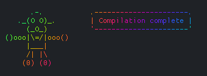

# botsay [](https://raw.githubusercontent.com/xyproto/botsay/main/LICENSE) [](https://goreportcard.com/report/github.com/xyproto/botsay)

Like cowsay, but with ASCII robots generated with [go-asciibot](https://github.com/mattes/go-asciibot), which is based on [asciibots](https://github.com/walsh9/asciibots), which is in turn based on [1k-asciibots](https://github.com/walsh9/1k-asciibots) which is inspired by the [Robot Factory](http://www.mains.me.uk/pocketeers/Htm-Designs/flipflopfaces.htm) game.

### Examples

Output of `botsay 'Build complete'`:

```
     .===.          .----------------.
    //o o\\         | Build complete |
    \\_v_//         '----------------'
  .==|>o<|==:=L
  '=c|___|
    .'._.'.
    |_| |_|
```

Output of `fortune | botsay`:

```
       Y__           .--------------------------------------------.
     _/- -\_         | If you think last Tuesday was a drag,      |
      \_O_/       --<| wait till you see what happens tomorrow!   |
   .==|>o<|==:=L     '--------------------------------------------'
   '=c|___|
      (   )
     __) (__
```

Output of `botsay -- $(botsay -o;botsay -o;botsay -o)`:

```
     _._._          .--------------------------------------------.
    -)O O(-         | )_( .--. |- -| '--' |_^_| o==|ooo|==o      |
     \_0_/       --<| |___| // \\ _\\ //_ .===./` .--. /.- -.    |
  .==|>o<|==:=L     | \ '--' "\_n_/" ,"|+ |". _\|+__|/_ ( )      |
  '=c|___|          | __) (__ _._._ .--. -)ooo(- '--' \_=_/      |
     ]| |[          | (m9\:::/\ /___\6 . /___\ . . ..:::::::. .  |
    [_| |_]         '--------------------------------------------'
```

Output of `date --iso-8601 | botsay`:

```
      .---.          .-------------.
     } - - {         | 2019-06-03  |
      \_O_/          '-------------'
  .-._/___\_.-.
  ;   \___/   ;
      |_|_|
      /_|_\
```

### Color support

Use `-c` if you wish to colorize the output text with a synthwave/rainbow-like effect:



### Installation

With Go 1.17 or later:

    go install github.com/xyproto/botsay@latest

### Flags

* `-c` - color the output with rainbow-like colors
* `-o` - only output robot, suppress message
* `-i` - specify a custom bot ID to use for generating the ASCII art.
* `-p` - print the bot's ID after generating the ASCII art.
* `--version` - output the current version
* `--help` - output brief help

### Known issues

* For longer pieces of text, there may be formatting issues.

## General info

* Version: 1.4.0
* License: BSD-3
* Author: Alexander F. Rødseth &lt;xyproto@archlinux.org&gt;
